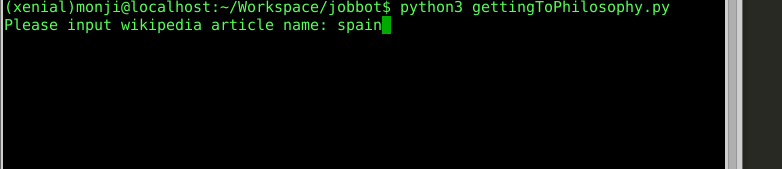

# gettingToPhilosophy
This script simply check Wikipedia's "Getting to Pholosophy" law.
It will ask to input WIkipedia article as starting point.
If you want to start from "https://en.wikipedia.org/wiki/Spain" please input "spain".

